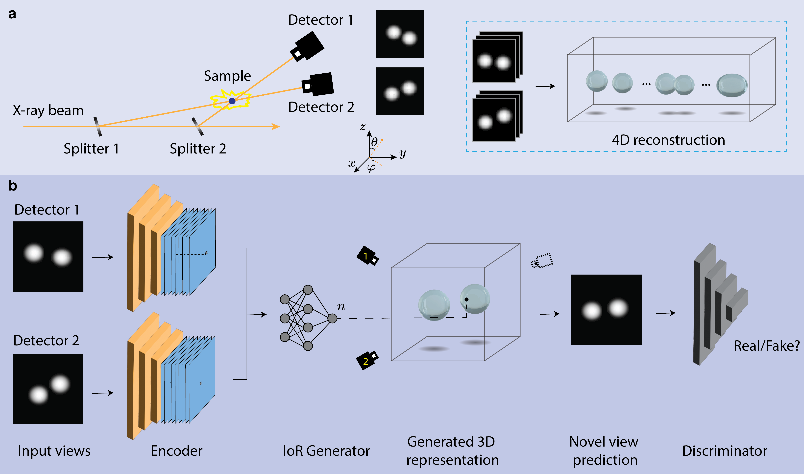

# 4D-ONIX for reconstructing 3D movies from sparse X-ray projections via deep learning
This repository contains the code used for 4D-ONIX, a deep learning method to reconstruct 3D movies of the droplets from the sparse views recorded by [X-ray multi-projection imaging (XMPI)](https://doi.org/10.1364/OPTICA.5.001521).  For more detailed information about ONIX training and performance, please refer to our [paper](https://arxiv.org/abs/2401.09508).

<p align="center">

</p>

This approach is based on [ONIX](https://github.com/pvilla/ONIX), a 3D multi-projection reconstruction approach that applied implicit neural representation to learn the mapping between the spatial coordinates and the complex refractive index.
In this work, we added a new dimention time to the algorithm, and learn the mapping from 4D spatial-temporal coordinates to the refractive index.
We reconstructed 3D movies of the droplets from two projections collected by XMPI.


## Getting Started
### Prerequisites

- Linux (not tested for MacOS or Windows)
- Python3
- NVIDIA GPU (not tested for CPU)

### Installation
Clone this repo:

```
git clone https://github.com/yuhez/ONIX_XMPI_Droplet_Recon.git
cd ONIX_XMPI_Recon
```
To install the required python packages via Anaconda:

```
conda env create -f environment.yml
conda activate onix
```

### Train instruction

Fix projection pretrain 

```
python3 train.py -n 2 -e test_pretrain --num_coarse 128 -p dataset/1205_denoised+registration+removebg_norm.npy --run_path results --num_epochs 10 --chunksize 4096 --num_random_rays 1024 --use_time --no_shuffle_input --lambda_mse 5 --lambda_generator 0.1 --print_loss_freq_iter 1 --save_plot_freq_epoch 1 --lr_d 0.0001 --lr 0.0001 -b 6 --val_idx 0 --val_view_idx='0,1' --save_model_freq_epoch 1
```

Random projection training with a GAN

```
python3 train.py -n 2 -e test --num_coarse 128 -p dataset/1205_denoised+registration+removebg_norm.npy --run_path results --num_epochs 100 --chunksize 4096 --num_random_rays 1024 --use_time --no_shuffle_input --lambda_mse 0.01 --lambda_generator 0.1 --lr_d 0.0001 --lr 0.0001 -b 6 --val_idx 0 --val_view_idx='0,1' --load_pretrain --model_path pretrain_model --load_epoch 5 --random_proj 
```


### Evaluation
Run `eval.py` to check the performance of the trained model and save 3D models. 
For evaluation options, please check out:

`python3 eval.py --help`

## Citation
If you use this code for your research, please cite our [paper](https://arxiv.org/abs/2401.09508).
```
@article{zhang20244d,
  title={4D-ONIX: A deep learning approach for reconstructing 3D movies from sparse X-ray projections},
  author={Zhang, Yuhe and Yao, Zisheng and Kl{\"o}fkorn, Robert and Ritschel, Tobias and Villanueva-Perez, Pablo},
  journal={arXiv preprint arXiv:2401.09508},
  year={2024}
}

```

## Acknowledgments
Parts of the code were based on [GRAF](https://github.com/autonomousvision/graf) and [ONIX](https://github.com/pvilla/ONIX).
